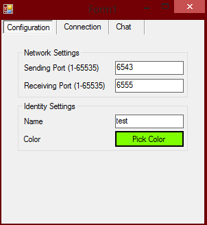
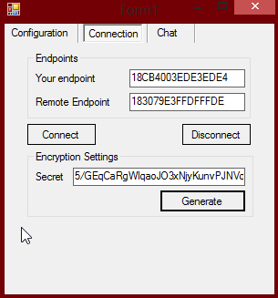
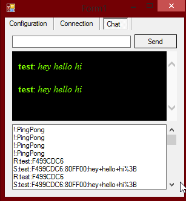

# FreeChat
P2P Messenger

## Using this thing

First, enter a sending and receiving port. Must be an available port, I usually pick 5000+ to be sure. Set your name and pick a color. Once that's done, click **Connection**

Send your friend your endpoint, enter their endpoint in Remote Endpoint. One of the two clicks "Generate", copies the secret, and shares it.The other pastes this secret in the secret field. Both then click Connect.

Go to the chat tab, type in the top bar, press enter, watch the chat flow in the black middle box. Bottom box is debug - it's the traffic you're receiving.

