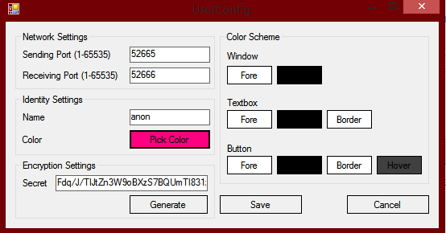
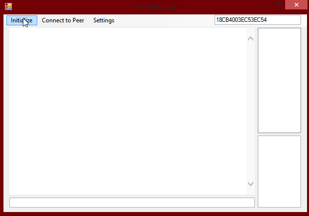
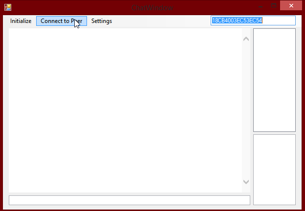
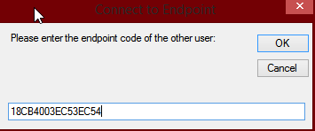
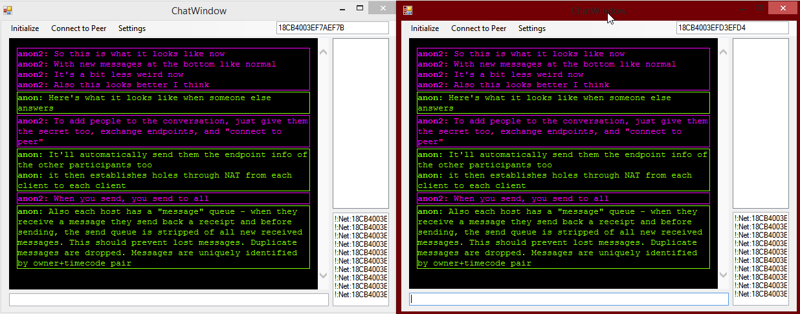

# FreeChat
P2P Messenger

## Using this thing

Click settings to set your identity information

Most important here - set your name, set your color (click the Pick Color button) and if you're using a shared secret, set it here. If you need a secret to share, click generate and share the result

Click Initialize to get your Endpoint information

Send your endpoint to your friend and get theirs then both click "Connect to peer"

Enter the endpoint info of your friend and press ok

Put text in the bar at the bottom and press enter and enjoy.

Want more people in the convo? Give the secret to the third, trade endpoints with the third. The third will get the seconds address in the ping and vice-versa and everyone adds the missing ones to their neighbors and tunnels to them and starts routing messages to all neighbors. As long as one person in the convo trades endpoints with someone and everyone has the same secret, the network meshes out to all participants.
